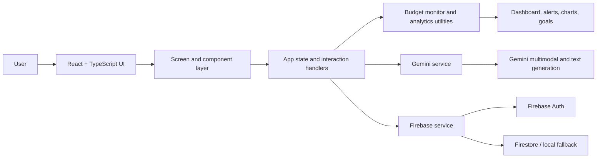

<div align="center">

# WiseupAI

### Your money, but smarter.

**A bilingual AI financial companion that helps students and young adults track spending, understand habits, and build better money decisions—one transaction at a time.**

[](https://react.dev/)
[](https://www.typescriptlang.org/)
[](https://vitejs.dev/)
[](https://ai.google.dev/)
[](https://firebase.google.com/)

[Live prototype](https://ai.studio/apps/52ef95eb-a1f1-45bb-9df5-be383c932c27) · [Report an issue](https://github.com/Jaysonar07/WiseupAI/issues) · [View the MVP specification](./MVP.md)

</div>

---

## The one-line pitch

**WiseupAI turns expense tracking from a boring spreadsheet into a culturally relevant, AI-powered coaching experience.** Instead of merely recording that a user spent money, it helps answer the questions that actually change behaviour: *Was this spending wise? Is my budget still on track? Why do I keep overspending? What should I do next?*

> **Built for the real world:** quick receipt capture, instant categorisation, visual budget pacing, goal tracking, and a witty bilingual “Financial Guru” that speaks English or Hinglish.

## Why WiseupAI exists

Students and early-career earners often understand that budgeting matters, but conventional finance tools create friction at exactly the wrong moment. Manual entry is tedious, charts are passive, and generic financial advice rarely feels personal or culturally relevant. By the time a user notices a problem, most of the month’s allowance may already be gone.

WiseupAI addresses this gap by combining **low-friction capture**, **behaviour-aware classification**, and **proactive coaching** in one focused experience. A receipt can become a structured transaction in seconds. A transaction can become an insight. An insight can become an actionable plan.

## What makes the project hackathon-worthy

| Hackathon dimension | WiseupAI’s approach | Why it matters |
|---|---|---|
| **Real user problem** | Helps students manage allowances, impulse purchases, subscriptions, food, shopping, and savings goals. | The product is easy to understand and immediately relevant to a large audience. |
| **Meaningful AI use** | Gemini handles multimodal receipt analysis, structured extraction, expense classification, and context-aware advice. | AI is embedded in the workflow rather than added as a superficial chatbot. |
| **Human-centred experience** | The Financial Guru uses a friendly English/Hinglish persona with praise, playful “roasts,” and recovery guidance. | Tone and cultural context make financial feedback more approachable. |
| **Actionable intelligence** | Budget thresholds, safe-spending signals, projections, goals, and emergency advice turn data into decisions. | Users receive a next step, not just a dashboard. |
| **Strong demo narrative** | Scan a receipt → verify the AI result → see the budget change → ask the Guru for advice. | The complete value loop is easy to demonstrate live. |
| **Accessible technical foundation** | React, TypeScript, Vite, Recharts, Motion, Firebase, and the Google GenAI SDK. | The prototype is modular, modern, and straightforward to extend. |

## Product experience

### 1. Set up a personal money context

The onboarding flow captures a user profile, language preference, monthly allowance or pocket-money limit, and an initial savings goal such as a laptop, phone, or trip. This context gives the AI and dashboard something meaningful to optimise for.

### 2. Capture spending with almost no friction

Users can add a transaction manually or scan a receipt, bill, or payment screenshot. The receipt workflow sends the image to Gemini’s multimodal model and extracts the merchant, amount, date, category, spending type, and a short insight. The result remains editable before it is added to the ledger.

### 3. Understand the decision behind the transaction

Each expense is mapped to one of three behavioural labels:

| Label | Meaning |
|---|---|
| **Wise** | A necessary or constructive expense that supports everyday life or long-term priorities. |
| **Considerable** | A thoughtful purchase that may be reasonable but deserves awareness and context. |
| **Impulsive** | A want-driven purchase that may undermine the user’s budget or savings goal. |

These labels are designed to encourage reflection without reducing personal finance to a simple “spent versus not spent” number.

### 4. Stay ahead of the budget

WiseupAI calculates current-month spending, remaining allowance, percentage consumed, budget level, and threshold status. The experience surfaces clear states—**on track**, **warning**, **critical**, and **exceeded**—with proactive alerts at 80%, 90%, and 100% of the allowance. When a user enters a danger zone, the Guru can provide a cut-back strategy or emergency recovery plan.

### 5. Turn financial data into a conversation

The Financial Guru receives the user’s transaction history, savings goals, allowance, and current prompt as context. It can provide a spending roast, praise discipline, explain patterns, suggest reductions, and recommend practical steps toward the user’s top goal. The default voice is witty and Hinglish-friendly, while formal English remains available for structured guidance.

### 6. Make progress visible

The analytics hub combines three complementary views: the split between scanned and manually entered expenses, cumulative spending versus a budget trajectory, and a calendar-style spending intensity view. Goal cards allow users to add savings progress and see momentum toward a concrete target.

## Core feature set

| Module | Capabilities |
|---|---|
| **Bilingual onboarding** | English/Hindi language toggle, profile setup, allowance capture, avatar selection, and goal creation. |
| **Financial dashboard** | Total spend, Wise/Considerable/Impulsive breakdown, budget health, safe-spending context, goals, and Guru quick actions. |
| **AI receipt scanner** | Camera or image upload, multimodal extraction, structured JSON output, editable verification, and one-tap ledger entry. |
| **Manual expense logger** | Fast transaction entry with AI category and behavioural classification, notes, and manual overrides. |
| **Analytics hub** | Source breakdown, monthly trend and projection, spending intensity calendar, and impulsive-trigger visibility. |
| **Financial Guru** | Context-aware English/Hinglish coaching, roasts, praise, budget recovery plans, and goal-oriented advice. |
| **Budget alert engine** | 80/90/100% thresholds, severity levels, remaining allowance, over-budget detection, and localised alert copy. |
| **Planning tools** | Savings goals, quick deposits, goal progress, and planning utilities such as SIP-oriented calculations in the broader MVP design. |
| **Student offers** | A dedicated space for student perks and deals in the product experience. |
| **Data controls** | Dark mode, profile customisation, settings, local persistence, cloud synchronisation where configured, and CSV export support in the MVP direction. |

## How the AI is used

WiseupAI uses the Google GenAI SDK through a dedicated service layer rather than scattering model calls across the UI. The integration currently supports three focused AI operations:

1. **Financial advice:** Generates context-aware coaching using transactions, goals, allowance, language, and the user’s question.
2. **Receipt analysis:** Accepts an image and returns structured merchant, amount, date, category, type, and insight fields.
3. **Manual classification:** Classifies a merchant and amount into a category, behavioural type, and explanation.

The receipt and manual-classification flows request structured JSON schemas, which makes the AI output easier to validate and render consistently in the interface. If an API key is unavailable, the service layer returns a controlled error message rather than crashing the entire application.

## System architecture



### Repository structure

```text
WiseupAI/
├── components/              # Shared navigation, widgets, charts, alerts, and UI elements
├── screens/                 # Welcome, setup, dashboard, analytics, tools, chat, scan, settings, and more
├── services/
│   ├── firebase.ts          # Authentication, persistence, Firestore, and local fallback
│   └── geminiService.ts     # Advice, receipt analysis, and manual classification
├── utils/
│   ├── budgetMonitor.ts     # Monthly budget calculations and threshold copy
│   └── mockData.ts          # Demo transactions and goals
├── public/                  # Static assets
├── App.tsx                  # Application state, routing between screens, and orchestration
├── types.ts                 # Transaction, Goal, ChatMessage, and AppState contracts
├── MVP.md                   # Detailed product and implementation specification
├── package.json             # Scripts and dependencies
└── vite.config.ts           # Vite configuration


## Technology stack

| Layer | Technology | Role in WiseupAI |
|---|---|---|
| **Frontend** | React 19 | Component-based application UI and screen composition. |
| **Language** | TypeScript | Typed application state, data models, and service contracts. |
| **Build tool** | Vite | Fast local development and production bundling. |
| **AI** | `@google/genai` with `gemini-3-flash-preview` | Text coaching, multimodal receipt understanding, and structured classification. |
| **Visualisation** | Recharts | Spending source, trend, and budget visualisations. |
| **Interaction design** | Motion | Transitions, feedback animations, and polished micro-interactions. |
| **Icons** | Lucide React and Material Symbols | Consistent navigation and financial iconography. |
| **Authentication and persistence** | Firebase Auth and Firestore | Google sign-in and user data synchronisation, with a local/mock fallback. |

## Getting started

### Prerequisites

You need **Node.js** and npm installed. The repository also includes a `bun.lock` file, but the documented scripts in `package.json` are npm-compatible.

### 1. Clone the repository

```bash
git clone https://github.com/Jaysonar07/WiseupAI.git
cd WiseupAI
```

### 2. Install dependencies

```bash
npm install
```

### 3. Configure the Gemini API key

Create a local environment file:

```bash
cp .env.example .env.local
```

Set the Gemini key expected by the current service implementation:

```env
API_KEY=your_gemini_api_key
```

> **Configuration note:** The original starter README refers to `GEMINI_API_KEY`, while `services/geminiService.ts` currently reads `process.env.API_KEY`. Use `API_KEY` for the checked-in implementation, or update the service and Vite environment handling if you prefer a different variable name.

### 4. Start the development server

```bash
npm run dev
```

Open the local URL printed by Vite, usually `http://localhost:5173`.

### 5. Create a production build

```bash
npm run build
```

To preview the production bundle locally:

```bash
npm run preview
```

## Demo path for judges

For the clearest two-minute demonstration, start with the following sequence:

| Time | Demo moment | What it proves |
|---:|---|---|
| 0:00–0:20 | Complete onboarding with a monthly allowance and savings goal. | Personalised setup and clear target user. |
| 0:20–0:55 | Scan a receipt or upload a bill image. | Multimodal AI reduces expense-entry friction. |
| 0:55–1:15 | Review and save the extracted transaction. | Human verification remains in the loop. |
| 1:15–1:35 | Open the dashboard and analytics. | The transaction immediately becomes decision-ready insight. |
| 1:35–1:55 | Trigger a Guru roast or ask for advice. | AI coaching is contextual, bilingual, and actionable. |
| 1:55–2:00 | Show an 80/90/100% alert state or recovery plan. | WiseupAI moves from passive tracking to proactive intervention. |

## Product principles

**Capture before compliance.** The first job is to make logging easy enough that users keep doing it.

**Explain, do not shame.** Behavioural labels and the Guru persona should create awareness and momentum, not moral judgement.

**Make the next action obvious.** Every insight should connect to a practical choice: reduce a category, protect a goal, pause an impulse, or ask for a recovery plan.

**Keep humans in the loop.** AI suggestions are reviewable and editable before they affect the ledger.

**Design for local context.** English/Hinglish support, Indian currency formatting, allowance-based budgeting, and culturally familiar language make the experience feel native to its audience.

## Current status and limitations

WiseupAI is a **prototype/MVP-oriented application**. The repository includes working UI flows, demo data, Gemini service functions, Firebase/local persistence logic, budget monitoring, and analytics-oriented components. Production deployment should still include a security review, robust environment-variable handling, server-side protection for secrets, validation of AI output, privacy controls for uploaded receipts, and comprehensive automated tests.

The project should not be treated as a substitute for regulated financial advice. AI outputs are educational suggestions and may be incomplete or incorrect; users should verify important financial decisions independently.

## Roadmap

| Stage | Direction |
|---|---|
| **Now** | Stabilise the prototype, improve loading and error states, validate receipt extraction, and strengthen the demo journey. |
| **Next** | Add richer recurring-expense detection, configurable budgets by category, notification preferences, and stronger transaction validation. |
| **Then** | Introduce privacy-first receipt processing, encrypted data controls, export/import workflows, and an evaluation set for AI classification quality. |
| **Scale** | Explore bank or UPI integrations where legally and technically appropriate, cohort-level financial education, and personalised behavioural insights over time. |

## Contributing

Contributions are welcome. Before opening a pull request, please explain the user problem being addressed, describe the UX or technical change, and include the validation steps you performed. For AI-related changes, document the prompt or schema impact and include representative examples of expected output.

```bash
git checkout -b feature/your-improvement
npm install
npm run build
git add .
git commit -m "feat: describe your improvement"
git push origin feature/your-improvement
```

Then open a pull request against `main`.

## License

No license file is currently included in the repository. Add an explicit license before distributing WiseupAI outside the project or accepting broad external contributions.

## Acknowledgements

WiseupAI is built with React, Vite, TypeScript, Google Gemini, Firebase, Recharts, Motion, Lucide, and the open-source ecosystem around them.

## References

[1]: https://github.com/Jaysonar07/WiseupAI "WiseupAI repository"
[2]: https://github.com/Jaysonar07/WiseupAI/blob/main/MVP.md "WiseupAI MVP specification"
[3]: https://github.com/Jaysonar07/WiseupAI/blob/main/package.json "WiseupAI package manifest"
[4]: https://github.com/Jaysonar07/WiseupAI/blob/main/services/geminiService.ts "WiseupAI Gemini service"
[5]: https://github.com/Jaysonar07/WiseupAI/blob/main/services/firebase.ts "WiseupAI Firebase service"
[6]: https://github.com/Jaysonar07/WiseupAI/blob/main/utils/budgetMonitor.ts "WiseupAI budget monitor"
[7]: https://github.com/Jaysonar07/WiseupAI/blob/main/types.ts "WiseupAI TypeScript data models"
[8]: https://ai.google.dev/ "Google AI for Developers"
[9]: https://firebase.google.com/ "Firebase"
[10]: https://recharts.org/ "Recharts"
[11]: https://motion.dev/ "Motion"

<div align="center">

**WiseupAI — spend consciously, save confidently.**

</div>
